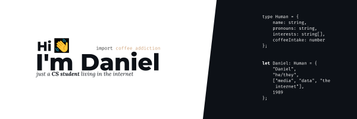

> ### Every action you take is a vote for the type of person you wish to become. 
> [James Clear, Atomic Habits](https://jamesclear.com/)
<br>

# 🥴 about me

- 💻 Studying **Computer Science** in De La Salle University in a few weeks 🤞🤞
- 🎥 Planning to minor in **Communication and New Media**
- 📚 **In love with information** from research to sharing insights
- ☕ **Coffee** is my water
- 📈 On my road to [✨ **eudaimonia** ✨](https://www.britannica.com/topic/eudaimonia)

```python 
# this is me trying
for day in range(0, 364): 
    self._health *= 1.01
    self._skills *= 1.01
    self._bad_habits *= 0.99
```

<br> 

# 🛠 some projects atm
### ReCall Flashcards

<a href="https://github.com/dhannn/ReCall">
    
</a>


#### Features

🔁 Effortlessly convert a text file of your notes to workable flashcards (IP)
<br>
📔 Store information about the level of mastery for each items (upcoming)
<br>
🧠 Retain concepts through an active recall system (upcoming)
